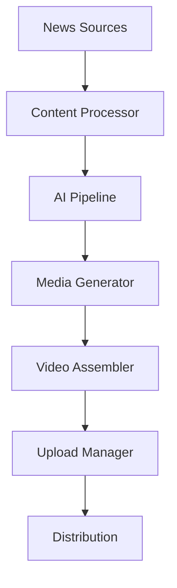

# 📺 VideoNews 📰

  

</br>
<a href="https://www.buymeacoffee.com/akumanomi1k"></a>

[🔗 Join the VideoNews Community on Telegram](https://t.me/VideoNewsCommunity)

## 🎯 Overview

VideoNews is an advanced automation framework that transforms news articles into engaging video content using a sophisticated multi-stage pipeline architecture. Perfect for content creators, media agencies, and digital marketers who want to automate their video content production.

## 📚 Documentation

Detailed documentation is available in the following sections:

- [AI Components](docs/AI.md) - Natural language, speech, and image generation capabilities
- [Database Architecture](docs/DATABASE.md) - Data models and storage systems
- [API Integration](docs/API.md) - External service integrations
- [Pipeline System](docs/PIPELINE.md) - Video processing pipeline architecture

## ⚙️ Core Features

- 🤖 **Intelligent Content Processing**
  - Automated article analysis and summarization
  - Smart media prompt generation
  - Content optimization for different platforms

- 🎬 **Dual Pipeline Support**
  - Short-form vertical videos (9:16) for TikTok/Reels
  - Long-form horizontal content (16:9) for YouTube
  
- 🎨 **Rich Media Generation**
  - AI-powered image generation
  - Dynamic text-to-speech with multiple providers
  - Automatic subtitle generation
  - Professional video assembly

- 📊 **Progress Monitoring**
  - Real-time pipeline stage tracking
  - Detailed success/failure metrics
  - Telegram integration for status updates

## 🏗️ Architecture

### System Components


### Data Flow


## 🛠️ Technical Requirements

- Python 3.10+
- FFmpeg
- SFML library
- Required API keys:
  - News API or Currents API
  - ElevenLabs (for TTS)
  - Pexels API (for media)
  - YouTube/TikTok API credentials

## 📦 Installation

1. **Clone the Repository**
```bash
git clone https://github.com/akumanomi1988/VideoNews.git
cd VideoNews
```

2. **Create Virtual Environment**
```bash
python -m venv venv
source venv/bin/activate  # Unix/macOS
venv\Scripts\activate     # Windows
```

3. **Install Dependencies**
```bash
pip install -r requirements.txt
```

4. **Configure Settings**
```bash
cp settings.example.json settings.json
# Edit settings.json with your API keys and preferences
```

## 🚀 Usage

### Basic Usage

```python
from news_video_processor import NewsVideoProcessor

processor = NewsVideoProcessor('settings.json')

# Generate short-form video
processor.process_latest_news_in_short_format({
    'url': 'https://example.com/article',
    'format': 'short',
    'aspect_ratio': '9:16'
})

# Generate long-form video
processor.process_latest_news_in_long_format({
    'url': 'https://example.com/article',
    'format': 'long',
    'aspect_ratio': '16:9'
})
```

### Telegram Integration

The system includes built-in Telegram bot integration for remote monitoring and control:

```bash
python telegram_bot.py
```

## 🔧 Configuration

See [API Documentation](docs/API.md) for detailed configuration options and API integrations.

## 📊 Monitoring

The system includes a comprehensive monitoring dashboard:

```bash
python scripts/run_dashboard.py
```

## 🤝 Contributing

Contributions are welcome! Please check our [Contributing Guidelines](CONTRIBUTING.md).

## 📝 License

This project is licensed under the MIT License - see the [LICENSE](LICENSE) file for details.

## 🙏 Acknowledgments

- Thanks to the amazing AI and ML communities
- All our contributors and supporters
- Special thanks to our Telegram community members

---

Built with ❤️ by the VideoNews Team
